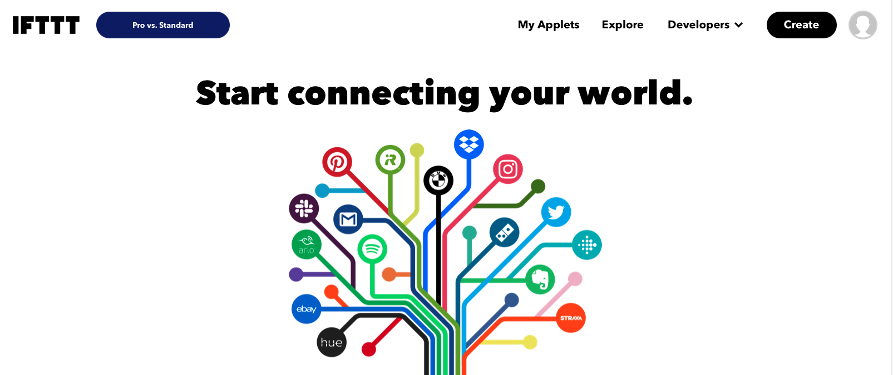
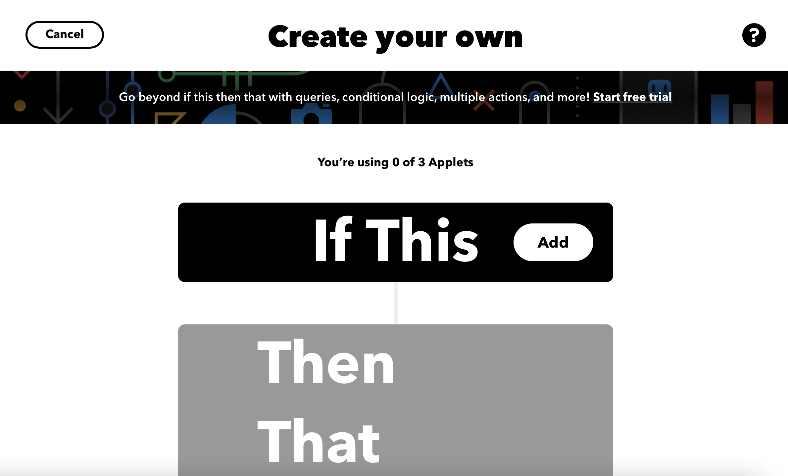
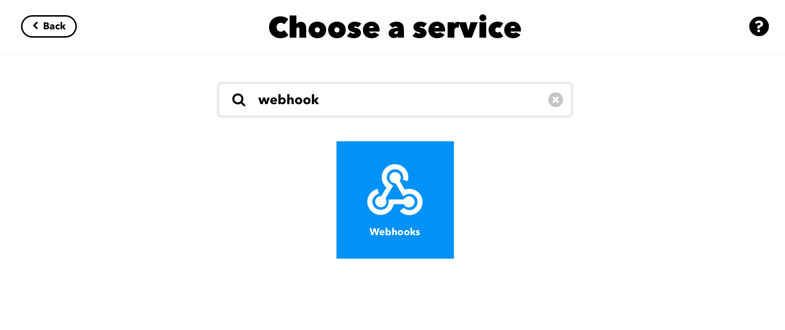
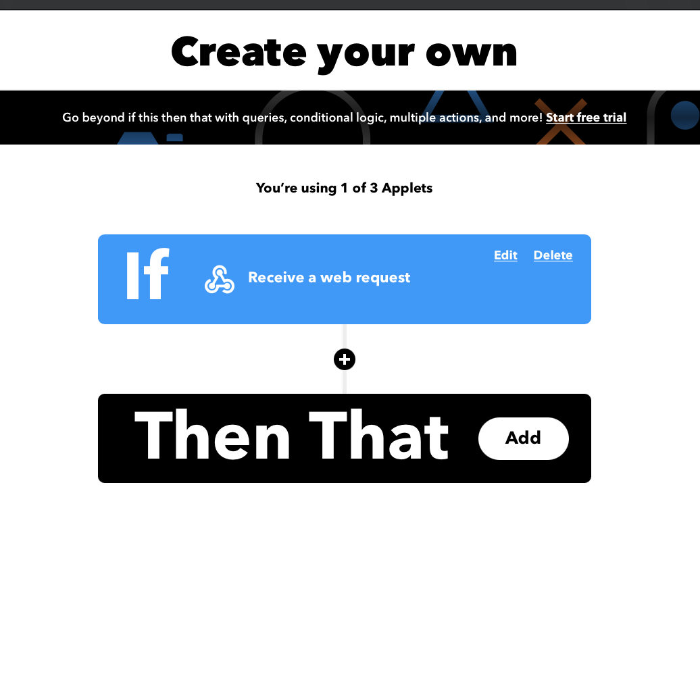
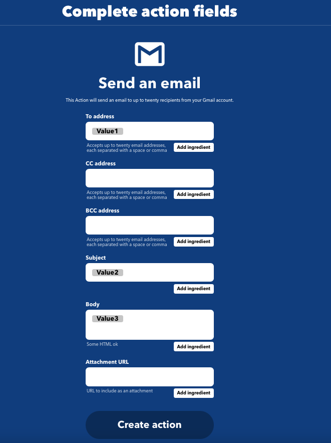

# Calibrate soil moisture sensor
Tool to calibrate a soil moisture sensor for a desired soil type with an ESP32  
 _(Tested with captor YL69 amd module HC-38)_  

## How it works

The tool performs 600 measurements and then calculates the average which gives the calibration value for the soil type.  

The result is sent by email via an IFTTT webhooks.  

The ESP goes into hibernation at the end of the measurements.  
To perform a new calibration, simply press the XXXX key.  

## Connect the soil moisture sensor 


## Create IFTTT webhooks

* Go to the link: https://ifttt.com/
* Then click on the "create" button 

* Then click on "add" in the "If This" section 

* Search for the "Webhooks" service

* Select "Receive a web request"

 Define the event name (to keep aside it will be used in the configuration file) then create the trigger

* In the "Then that" section click on "add

* Search for the Gmail service
* Then select "send an email"

* Complete action fields like this:



* Go to the following link to get your key: https://ifttt.com/maker_webhooks/settings   
The key is at the end of the URL
  

## Setup 


* First copy the template:  
`cp lib/config/config_template.h /lib/config/config.h`

* Configure the following variables with your credentials:  
```
// IFTTT Setting
#define IFTTT_KEY  "YOUR_IFTTT_KEY" // Replace with your unique IFTTT Key, can be obtained at this link: https://ifttt.com/maker_webhooks/settings.
#define GMAIL_TRIGGER "YOUR_TRIGGER_FOR_GMAIL"  // Replace with your trigger event name.

// WIFI Setting
#define WIFI_SSID "YOUR_WIFI_SSID" // Replace with your wifi ssid.
#define WIFI_PWD "YOUR_WIFI_PASSWORD" // Replace with your wifi password

// Mail Setting
#define MAILTO "YOUR_MAIL" // Replace with your email.
```